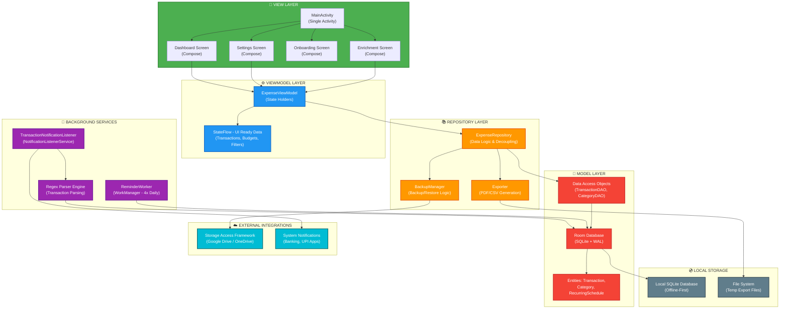
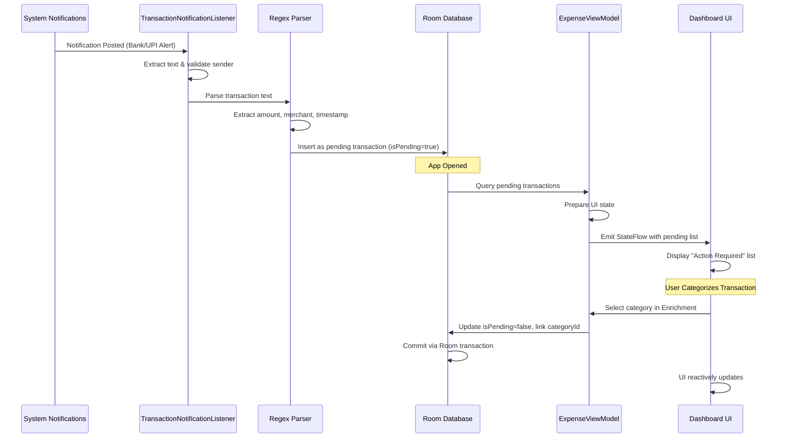
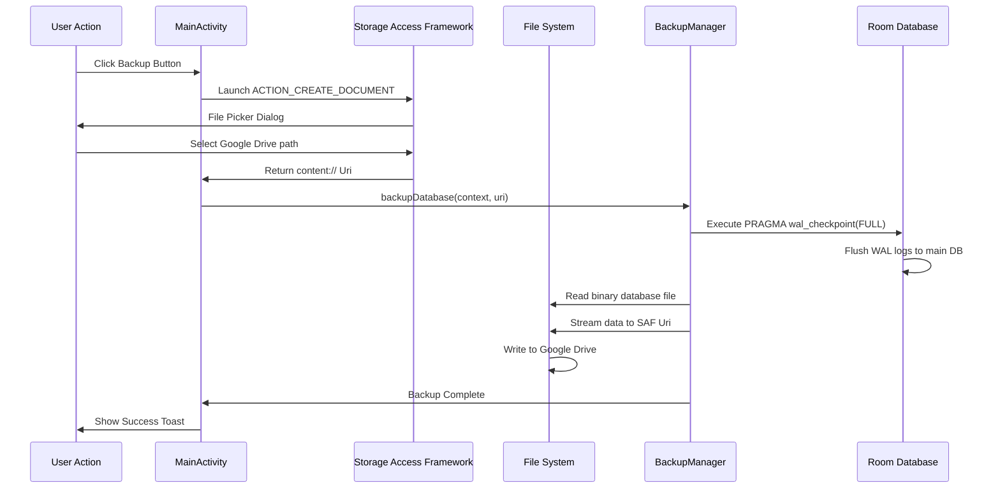
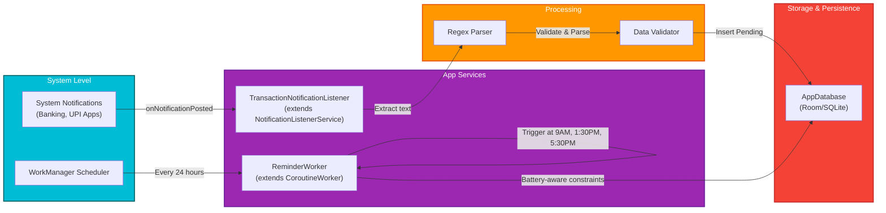

# KharchaDekh - Privacy-First Automated Expense Tracker

----
> [Download Now](https://play.google.com/store/apps/details?id=com.ankitsudegora)
> On Google Play Store
----
KharchaDekh is a smart, automated personal finance manager designed specifically for India. It operates **100% offline and locally**, parsing transaction notifications (banking and UPI alerts) on-device using native regex engines.

---

## 🏗️ System Architecture

### Overall Architecture Layers

### Data Flow: Transaction Capture Lifecycle

### Data Flow: SAF Database Backup Lifecycle

### Background Services Architecture

---

## 📂 Repository Structure & Navigation

Below is the directory map of the codebase. Click on any folder or key file to navigate directly:

*   📂 **[.build-outputs/](file:///d:/2026/Project/KharchaDekh/.build-outputs/)** — Holds compiled deployment binaries and store upload materials.
    *   📄 [KharchaDekh.apk](file:///d:/2026/Project/KharchaDekh/.build-outputs/KharchaDekh.apk) — The signed, release-ready production APK (v1.0.0.2).
    *   📄 [KharchaDekh.aab](file:///d:/2026/Project/KharchaDekh/.build-outputs/KharchaDekh.aab) — The signed release Android App Bundle (AAB) for Google Play Console uploading.
    *   📄 [release_notes.txt](file:///d:/2026/Project/KharchaDekh/.build-outputs/release_notes.txt) — Play Console upload release logs (en-GB format).
*   📂 **[app/](file:///d:/2026/Project/KharchaDekh/app/)** — Main Android Application Module.
    *   📂 **[src/main/java/com/ankitsudegora/](file:///d:/2026/Project/KharchaDekh/app/src/main/java/com/ankitsudegora/)** — Kotlin source code packages.
        *   📂 [data/](file:///d:/2026/Project/KharchaDekh/app/src/main/java/com/ankitsudegora/data/) — Room DB schema (`AppDatabase.kt`), entity definitions (`Transaction`, `Category`, `RecurringSchedule`), and repository.
        *   📂 [service/](file:///d:/2026/Project/KharchaDekh/app/src/main/java/com/ankitsudegora/service/) — Contains the background `TransactionNotificationListener` service which runs on-device notification parsing.
        *   📂 [ui/](file:///d:/2026/Project/KharchaDekh/app/src/main/java/com/ankitsudegora/ui/) — Declarative Jetpack Compose components, theme styles (`Color.kt`, `Theme.kt`), and UI screens.
        *   📂 [util/](file:///d:/2026/Project/KharchaDekh/app/src/main/java/com/ankitsudegora/util/) — Business tools, including database zipping/restoring (`BackupManager.kt`) and native PDF/CSV generators (`Exporter.kt`).
        *   📂 [worker/](file:///d:/2026/Project/KharchaDekh/app/src/main/java/com/ankitsudegora/worker/) — WorkManager scheduling jobs (`ReminderWorker.kt`) for 4x daily checkpoints.
        *   📂 [viewmodel/](file:///d:/2026/Project/KharchaDekh/app/src/main/java/com/ankitsudegora/viewmodel/) — State flow managers (`ExpenseViewModel.kt`) bridging database actions to the screens.
        *   📄 [MainActivity.kt](file:///d:/2026/Project/KharchaDekh/app/src/main/java/com/ankitsudegora/MainActivity.kt) — Core Launcher Activity and SAF result callback listeners.
    *   📄 [AndroidManifest.xml](file:///d:/2026/Project/KharchaDekh/app/src/main/AndroidManifest.xml) — Defines system permissions, file providers, and service hooks.
    *   📄 [build.gradle.kts](file:///d:/2026/Project/KharchaDekh/app/build.gradle.kts) — Module configuration detailing app ID, versions, dependencies, and signing targets.
*   📂 **[documentation/](file:///d:/2026/Project/KharchaDekh/documentation/)** — In-depth technical architecture and personal learnings.
    *   📄 [overview.md](file:///d:/2026/Project/KharchaDekh/documentation/overview.md) — Solopreneur vision and product problem statements.
    *   📄 [requirements_use_cases.md](file:///d:/2026/Project/KharchaDekh/documentation/requirements_use_cases.md) — Scope, constraints, and user action steps.
    *   📄 [architecture.md](file:///d:/2026/Project/KharchaDekh/documentation/architecture.md) — MVVM structure and data flow maps.
    *   📄 [data_model_apis.md](file:///d:/2026/Project/KharchaDekh/documentation/data_model_apis.md) — SQLite fields, regex parsing rules, and SAF streams.
    *   📄 [implementation_details.md](file:///d:/2026/Project/KharchaDekh/documentation/implementation_details.md) — Code walk-throughs for exporters, charts, and workers.
    *   📄 [challenges_resolutions.md](file:///d:/2026/Project/KharchaDekh/documentation/challenges_resolutions.md) — How core database, thread, and theme constraints were solved.
    *   📄 [incident_postmortems.md](file:///d:/2026/Project/KharchaDekh/documentation/incident_postmortems.md) — Analysis of previous database write and worker bugs.
    *   📄 [personal_learnings.md](file:///d:/2026/Project/KharchaDekh/documentation/personal_learnings.md) — Personal takeaways and insights.
*   📄 **[DEVELOPER.md](file:///d:/2026/Project/KharchaDekh/DEVELOPER.md)** — Core onboarding guide, local properties config instructions, and build commands.
*   📄 **[privacy_policy.html](file:///d:/2026/Project/KharchaDekh/privacy_policy.html)** — DPDP compliance document, ready to be hosted as the Play Store Privacy URL.
*   📄 **[my-upload-key.jks](file:///d:/2026/Project/KharchaDekh/my-upload-key.jks)** — Upload key keystore used to sign compiled outputs.

*   📂 **[.build-outputs/](./.build-outputs/)** — Holds compiled deployment binaries and store upload materials.
    *   📄 [KharchaDekh.apk](./.build-outputs/KharchaDekh.apk) — The signed, release-ready production APK (v1.0.0.2).
    *   📄 [KharchaDekh.aab](./.build-outputs/KharchaDekh.aab) — The signed release Android App Bundle (AAB) for Google Play Console uploading.
    *   📄 [release_notes.txt](./.build-outputs/release_notes.txt) — Play Console upload release logs (en-GB format).
*   📂 **[app/](./app/)** — Main Android Application Module.
    *   📂 **[src/main/java/com/example/](./app/src/main/java/com/example/)** — Kotlin source code packages.
        *   📂 [data/](./app/src/main/java/com/example/data/) — Room DB schema (`AppDatabase.kt`), entity definitions (`Transaction`, `Category`, `RecurringSchedule`), and repository.
        *   📂 [service/](./app/src/main/java/com/example/service/) — Contains the background `TransactionNotificationListener` service which runs on-device notification parsing.
        *   📂 [ui/](./app/src/main/java/com/example/ui/) — Declarative Jetpack Compose components, theme styles (`Color.kt`, `Theme.kt`), and UI screens.
        *   📂 [util/](./app/src/main/java/com/example/util/) — Business tools, including database zipping/restoring (`BackupManager.kt`) and native PDF/CSV generators (`Exporter.kt`).
        *   📂 [worker/](./app/src/main/java/com/example/worker/) — WorkManager scheduling jobs (`ReminderWorker.kt`) for 4x daily checkpoints.
        *   📂 [viewmodel/](./app/src/main/java/com/example/viewmodel/) — State flow managers (`ExpenseViewModel.kt`) bridging database actions to the screens.
        *   📄 [MainActivity.kt](./app/src/main/java/com/example/MainActivity.kt) — Core Launcher Activity and SAF result callback listeners.
    *   📄 [AndroidManifest.xml](./app/src/main/AndroidManifest.xml) — Defines system permissions, file providers, and service hooks.
    *   📄 [build.gradle.kts](./app/build.gradle.kts) — Module configuration detailing app ID, versions, dependencies, and signing targets.
*   📂 **[documentation/](./documentation/)** — In-depth technical architecture and personal learnings.
    *   📄 [overview.md](./documentation/overview.md) — Solopreneur vision and product problem statements.
    *   📄 [requirements_use_cases.md](./documentation/requirements_use_cases.md) — Scope, constraints, and user action steps.
    *   📄 [architecture.md](./documentation/architecture.md) — MVVM structure and data flow maps.
    *   📄 [data_model_apis.md](./documentation/data_model_apis.md) — SQLite fields, regex parsing rules, and SAF streams.
    *   📄 [implementation_details.md](./documentation/implementation_details.md) — Code walk-throughs for exporters, charts, and workers.
    *   📄 [challenges_resolutions.md](./documentation/challenges_resolutions.md) — How core database, thread, and theme constraints were solved.
    *   📄 [incident_postmortems.md](./documentation/incident_postmortems.md) — Analysis of previous database write and worker bugs.
    *   📄 [personal_learnings.md](./documentation/personal_learnings.md) — Personal takeaways and insights.
*   📄 **[DEVELOPER.md](./DEVELOPER.md)** — Core onboarding guide, local properties config instructions, and build commands.
*   📄 **[privacy_policy.html](./privacy_policy.html)** — DPDP compliance document, ready to be hosted as the Play Store Privacy URL.
*   📄 **[my-upload-key.jks](./my-upload-key.jks)** — Upload key keystore used to sign compiled outputs.

---

## 🚀 Run Locally

### Prerequisites
*   [Android Studio](https://developer.android.com/studio) installed.
*   JDK 17 or higher configured on your PATH.

### Steps
1.  Open Android Studio, select **Open**, and choose the root directory of this project.
2.  Allow Gradle sync to download packages and index files.
3.  Run the application on an emulator or physical testing device.
4.  To build signed release builds locally, refer to the CLI variables in the [DEVELOPER.md](./DEVELOPER.md) guide.
